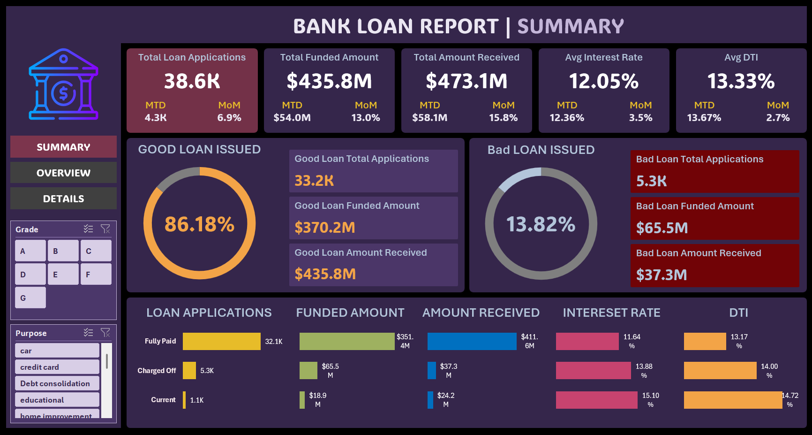
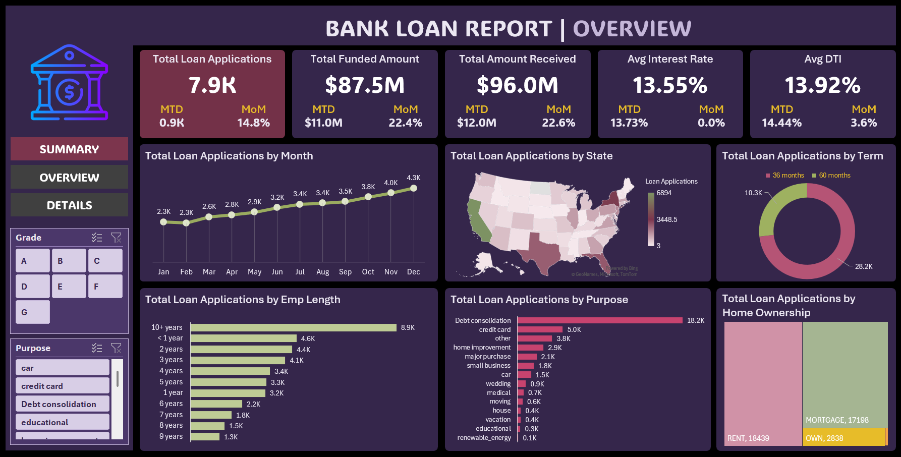

# 📊 Bank Loan Analysis Dashboard (Microsoft Excel)

## 1. Project Description

This repository contains a **Bank Loan Analysis Dashboard** developed using **Microsoft Excel** to evaluate loan portfolio performance and credit risk indicators.
The project applies structured data analysis techniques to transform raw loan data into **interactive dashboards** that support financial reporting and decision-making within the banking sector.

The analysis focuses on loan application trends, funding efficiency, repayment behavior, borrower risk profiles, and portfolio quality, with particular attention to **good loans versus bad loans** classification.

---

## 2. Project Objectives

The primary objectives of this project are to:

* Analyze overall bank loan portfolio performance
* Monitor trends in loan applications and funding over time
* Evaluate repayment outcomes and credit risk exposure
* Compare **good loans** and **bad loans** using financial KPIs
* Demonstrate advanced Excel dashboarding and reporting skills

---

## 3. Key Performance Indicators (KPIs)

The dashboard reports the following metrics:

* **Total Loan Applications**
* **Total Funded Amount**
* **Total Amount Received**
* **Average Interest Rate**
* **Average Debt-to-Income (DTI) Ratio**
* **Month-to-Date (MTD) Performance**
* **Month-over-Month (MoM) Growth**

These indicators are commonly used in banking analytics to assess loan quality and borrower affordability.

---

## 4. Dashboard Structure

### 4.1 Summary Dashboard

Provides a high-level overview of portfolio health, including:

* Overall loan volume and funding
* Good loan vs. bad loan distribution
* Funded amounts and repayment performance
* Loan status classification:

  * Fully Paid
  * Charged Off
  * Current

### 4.2 Overview Dashboard

Offers detailed analytical breakdowns, including:

* Monthly loan application trends
* Geographic distribution by U.S. state
* Loan term comparison (36 vs. 60 months)
* Loan purpose analysis
* Employment length distribution
* Home ownership segmentation

---

## 5. Tools and Technologies

* **Microsoft Excel**

  * Data cleaning and preparation
  * Pivot tables and pivot charts
  * Calculated fields and KPIs
  * Interactive dashboard design

---

## 6. Data Analysis Methodology

1. Data understanding and validation
2. Cleaning and formatting of raw loan data
3. KPI calculations and metric definitions
4. Pivot table modeling for aggregation
5. Dashboard visualization and layout optimization
6. Insight extraction and result interpretation

---

## 7. Dashboard Preview

### Summary View

### Overview View

---

## 8. Analytical Insights

* The majority of issued loans are categorized as **good loans**, indicating a stable portfolio
* **Debt consolidation** represents the most frequent loan purpose
* Loan application volumes show a consistent upward monthly trend
* Higher interest rates and elevated DTI ratios are more prevalent among **charged-off loans**

These findings align with standard credit risk assessment principles used in financial institutions.

---

## 9. Learning Outcomes

Through this project, the following skills were developed:

* Practical application of **financial data analysis** concepts
* Advanced use of **Excel dashboards and pivot tables**
* Interpretation of credit risk indicators
* Professional data storytelling and reporting

---

## 10. Author

**Hadeer Altabaa**

BSc Computing with Business – Faculty of Information Technology,
Data Analytics & Business Intelligence

*🔗**GitHub:** [Hadeer.Altabaa](https://github.com/HadeerAltabaa)
*🔗**LinkedIn** [Hadeer Altabaa](https://www.linkedin.com/in/hadeeraltabaajuniorwebdeveloper)

